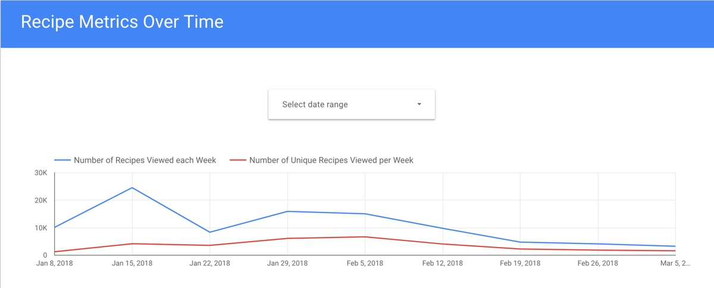
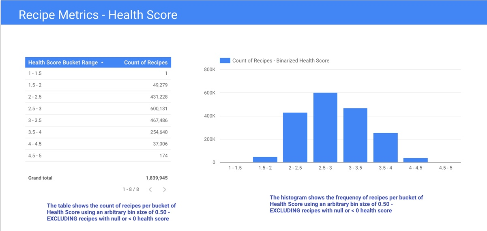
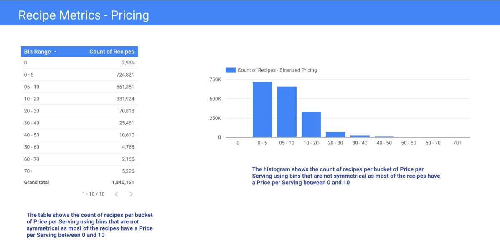
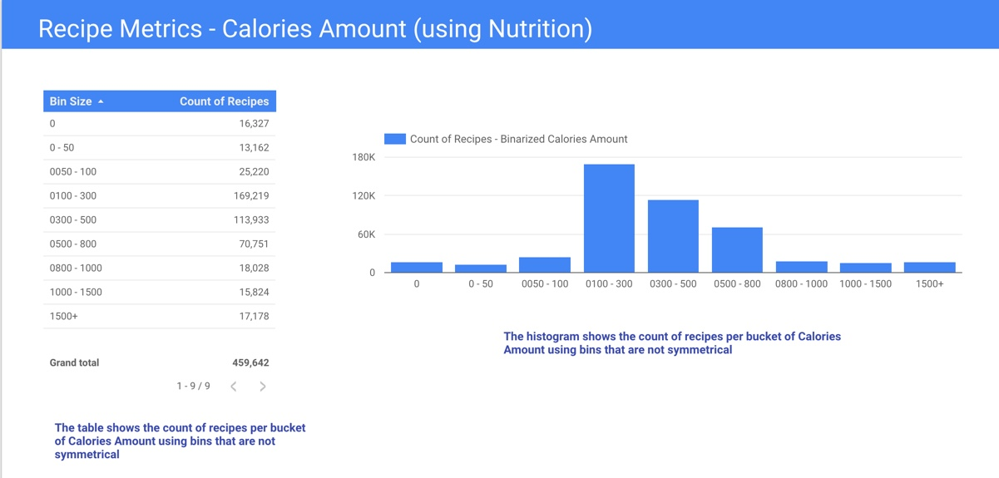

# DSCI6010-student
GalvanizeU-University of New Haven Master of Science in Data Science - DSCI6010: Data Science Internship.

This internship has been done in the same company where the Capstone was completed, which is [wellio](http://www/getwellio.com).

The main goal of the internship has been developing and implementing a business dashboard with metrics that are relevant to the business using Google's Data Studio.

I show some screenshots of the dashboard as well as some of the SQL statements that I have implemented to obtain some of the relevant metrics: these are the files with the naming convention ```SQL-xx.sql```.






Queries have been tested first in Google Cloud Platform BigQuery.

Also, some notebooks have been developed using Google Cloud Datalab to perform EDA in some datasets.

The python environment is the same one that was set up during the [Capstone project](https://github.com/carlespoles/DSCI6051-student), as well as the instructions to create a Google Cloud Platform VM instance to create and lunch notebooks using Datalab.